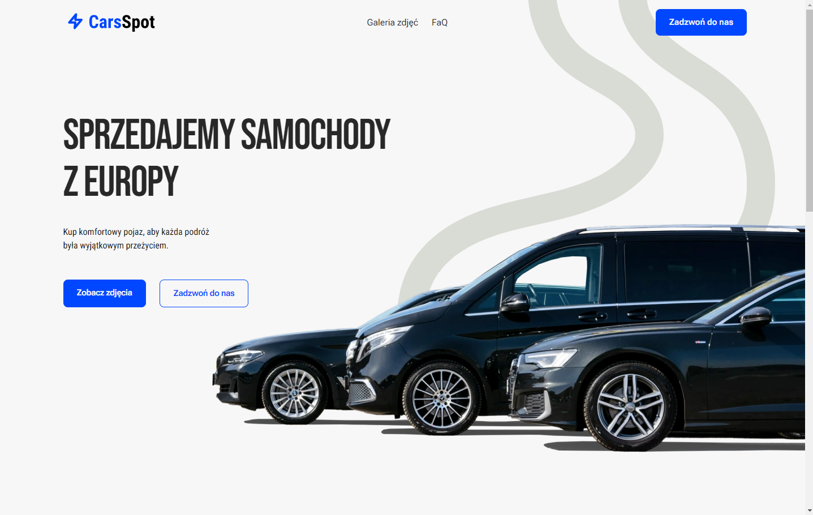
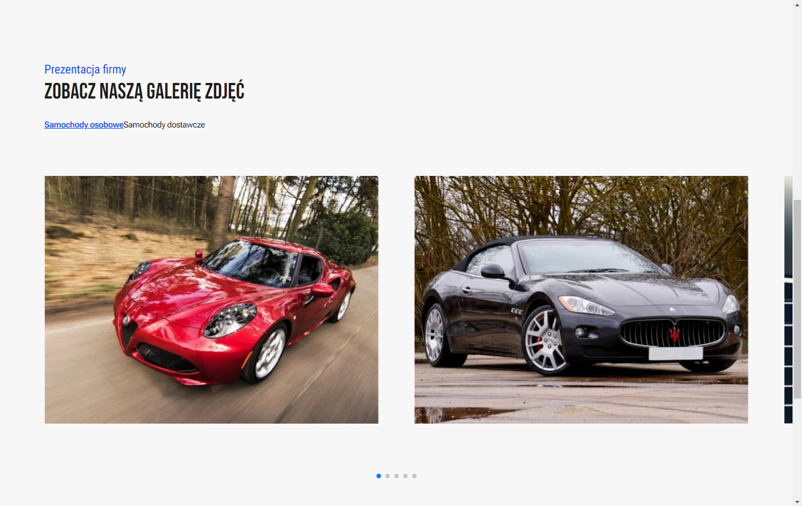
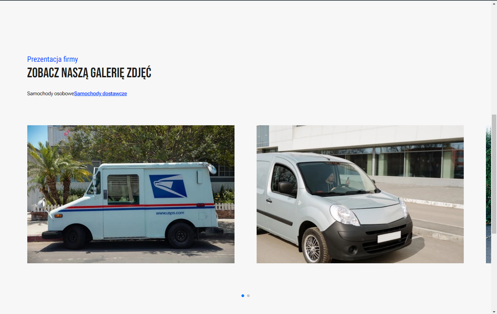
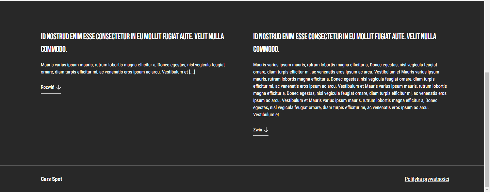
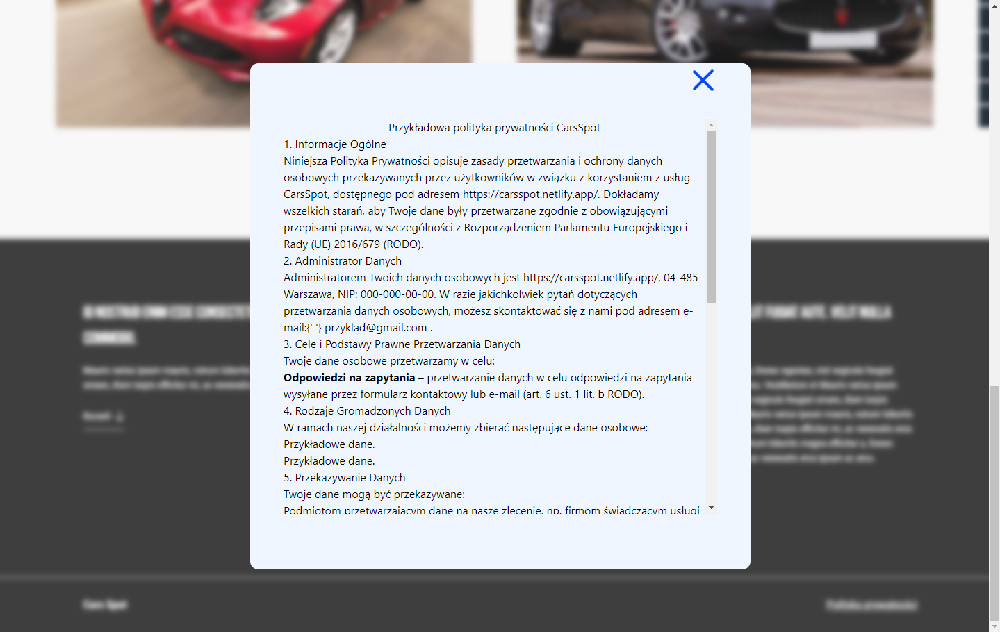
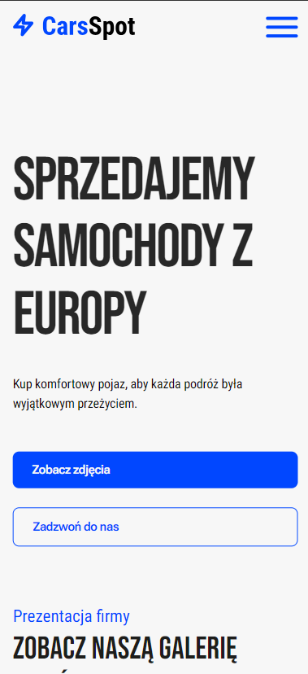
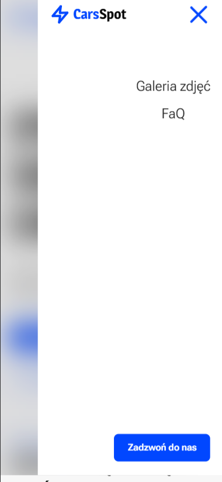

# Zadanie rekrutacyjne Landing Page CarsSpot

#### Sprawdź wersję Demo [tutaj](https://carsspot.netlify.app/)

## Opis:

Landing page stworzony w HTML, CSS, Tailwind, JavaScript jako część zadania rekrutacyjnego, którego celem było wdrożenie statycznej strony na podstawie mockupu przygotowanego w Figmie. Od siebie dodałem kilka animacji w AOS oraz wykorzystałem bibliotekę Swiper do stworzenia caruzeli zdjęć.

<br />

## Techstack:

- HTML
- CSS
- Tailwind
- JavaScript

#### Narzędzia:

- Eslint
- Prettier
- AOS
- Swiper
- Vite
- Netlify

<br />

## Funkcjonalności:

- [x] Deployment landing page na Netlify
- [x] Zaprojektowanie opengraph image
- [x] Implementacja opengraph dla mediów społecznościowych
- [x] Rozwinięte metatagi pod SEO
- [x] Responsywność na wszystkie urządzenia: mobilne, tablety, ekrany 4k
- [x] Animacje
- [x] Wdrożenie interaktywnych zakładek dla wyświetlania osobnych sliderów dla poszczególnych rodzajów samochodów
- [x] Optymalizacja obrazków do formatu WebP
- [x] Optymalizacja obrazków poprzez technikę lazy loading
- [x] Karuzela zdjęć z wykorzystaniem biblioteki Swiper
- [x] Rozwijalne artykuły w dolnej sekcji strony kiedy tekst jest zbyt długi
- [x] Dialog Alert z polityką prywatności

## Bugi:
- [ ] Właściwość gap-12 nie działa dla kontenera zawierającego przyciski do nawigacji pomiedzy sliderami

<br />

## ScreenShots:














<br />

## Jak uruchomić projekt lokalnie:

Sklonuj repozytorium

```bash
git clone https://github.com/rafal19987/Recruitment-Task-CarsSpot-Landing-Page-HTML-Tailwind-JavaScript-Vite.git
```

Przejdź do folderu

```bash
cd Recruitment-Task-CarsSpot-Landing-Page-HTML-Tailwind-JavaScript-Vite
```

Zainstaluj dependencies

```bash
npm install
```

Uruchom środowisko developerskie

```bash
npm run dev
```

Przejdź pod adres http://localhost:5173/
